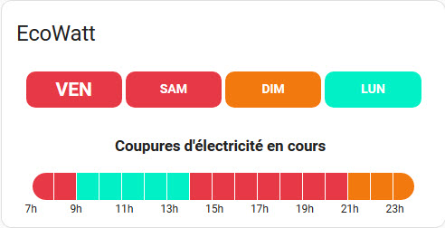

# EcoWatt-card pour Home Assistant

EcoWatt is a solution for electricity monitoring in France.
This documentation will be in french.

Pour obtenir des informations sur EcoWatt, veuillez visiter le site https://www.monecowatt.fr/.



## Installation

Utilisez [HACS](https://hacs.xyz/) [](https://github.com/alexandreaudrain/ecowatt-card)

## Configuration

La carte EcoWatt est alimentée par une entité qui doit avoir un attribut 'signals' identique à ce que produit l'API EcoWatt v4.
Par exemple :

```json
{   
    "signals": [
        {
            "GenerationFichier": "2022-06-03T07:36:25+02:00",
            "jour": "2022-06-06T00:00:00+02:00",
            "dvalue": 1,
            "message": "Situation normale ",
            "values": [
                {"pas": 0, "hvalue": 1},
                {"pas": 1, "hvalue": 1},
                {"pas": 2, "hvalue": 1},
                {"...": "..."},
                {"pas": 21, "hvalue": 1},
                {"pas": 22, "hvalue": 1},
                {"pas": 23, "hvalue": 1}
            ]
        },
        {
            {"...": "..."}
        }
    ]
}
```

### API EcoWatt

Pour obtenir les données depuis l'API :

- créez un compte sur [le site de RTE](https://data.rte-france.com/web/guest)
- abonnez-vous à [l'API Ecowatt](https://data.rte-france.com/catalog/-/api/consumption/Ecowatt/v4.0)
- obtenez le `client_id` et `client_secret`

Vous pourrez ainsi solliciter l'API EcoWatt et alimenter la carte EcoWatt

### Configurer la carte

La méthode la plus simple consiste à utiliser l'éditeur graphique.

Un seul paramètre est obligatoire : l'entité qui porte les données de l'API EcoWatt
Sont optionnels :

- le libellé associé à la carte
- la couleur associée à une situation normale
- la couleur associée à un risque de coupure
- la couleur associée à des coupures programmées